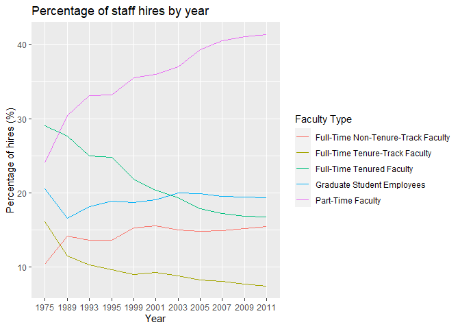
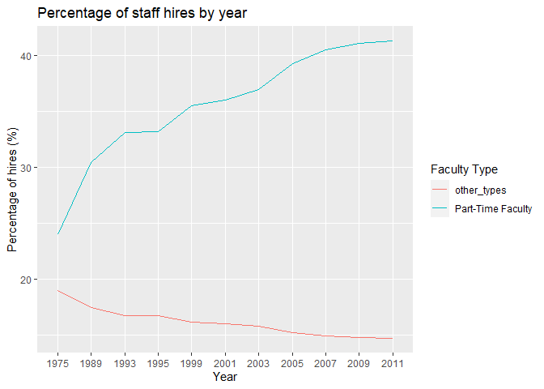
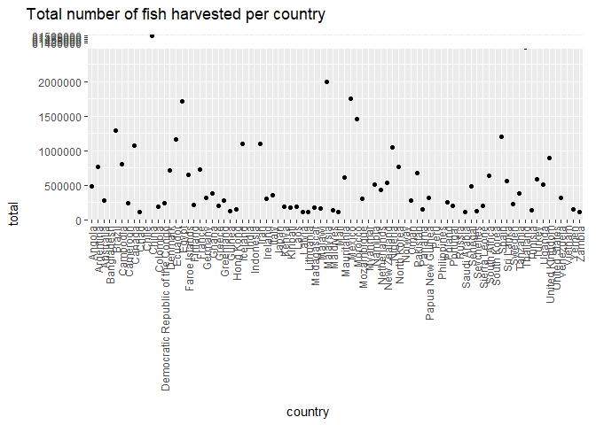
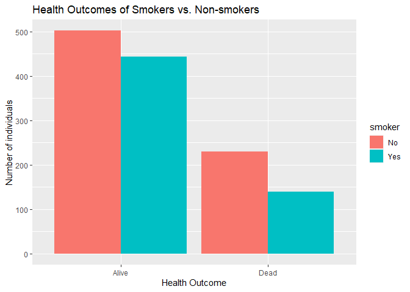
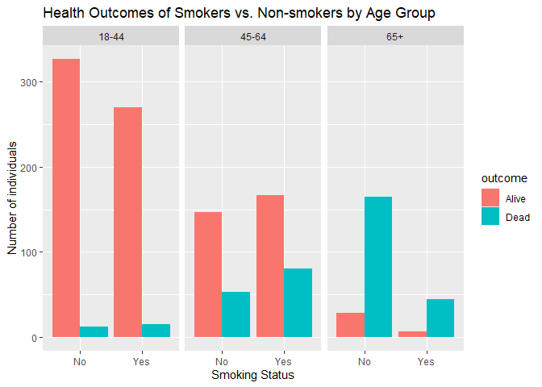

Lab 06 - Ugly charts and Simpson’s paradox
================
Cat Seitz
2/2/23

### Load packages and data

``` r
library(tidyverse) 
library(dsbox)
library(mosaicData) 
library(ggbreak) 
library(patchwork)
```

### Exercise 1

``` r
staff <- read_csv("data/instructional-staff.csv", show_col_types = FALSE)
```

After pivoting the data, the data frame should be 55 rows.

``` r
staff_long <- staff %>%
  pivot_longer(-faculty_type, names_to = "year") %>%
  mutate(value=as.numeric(value))
```

``` r
staff_long %>%
  ggplot(aes(x = year,
             y = value,
             group = faculty_type,
             color = faculty_type)) +
  geom_line()+
  labs(title="Percentage of staff hires by year",
       x="Year",
       y="Percentage of hires (%)")+
  guides(color = guide_legend(title="Faculty Type"))
```

<!-- -->

### Exercise 2

In order to show that the proportion of part-time faculty hiring has
increased compared to other instructional staff types, I would make a
new data frame with the average of the four other staff types and then
create the same graph.

``` r
staff_df <- staff_long %>%
  subset(faculty_type!="Part-Time Faculty")

staff_df<- staff_df %>%
  group_by(year)%>%
  summarise(mean_pct=mean(value),
            faculty_type="other_types")

pt_faculty <- staff_long %>%
  subset(faculty_type=="Part-Time Faculty")
```

``` r
ggplot() +
geom_line(data=pt_faculty,aes(x = year,
           y = value,
           group = faculty_type,
           color = faculty_type))+
geom_line(data=staff_df,aes(x = year,
           y = mean_pct,
           group = faculty_type,
           color = faculty_type))+
  labs(title="Percentage of staff hires by year",
       x="Year",
       y="Percentage of hires (%)")+
  guides(color = guide_legend(title="Faculty Type"))
```

<!-- -->

### Exercise 3

The goal to improve the fisheries graph is to plot the data with a scale
break since it seems like there are only a few countries that
capture/farm way more fish than the rest. First, I’m going to filter the
data for countries that have a total harvest of over 100,000 tons. After
the filter, we now have 82 countries.

``` r
fisheries <- read_csv("data/fisheries.csv", show_col_types = FALSE)
```

``` r
fisheries <- fisheries%>%
  filter(total>100000)
```

``` r
g <- ggplot(data=fisheries, 
            aes(x=country, y=total))+ #, group=country, color=country
  geom_point()
g2<- g+ scale_y_break(c(2350000,81400000))
g2+theme(axis.text.x = element_text(angle = 90, vjust = 0.5, hjust=1))+
  labs(title = "Total number of fish harvested per country")
```

<!-- -->

Since there are still 82 countries that capture/farm over 100,000 fish,
our x-axis will always be super jumbled if we keep all 82 countries in
one graph. We could (1) raise the bar of how many fish a country needs
to capture/farm to get on the graph or (2) break down the graph into a
several graphs based on continent. Possibly, putting country on the
y-axis would give us more room to see the country. I could also try
plotting captured and farmed fish separately, but this wouldn’t fix our
x-axis problem.

I’m going to filter again for at least 50,000 fish in each capture and
farm categories to decrease the number of countries that qualify for the
graph and see if it’s low enough to make a better graph. After doing
this, the number of farmed fishery locations decreased to 40 and the
number of captured fishery location stayed at 82. Then, I increased the
number of capture fish to 100,000. Now, I will create two separate
graphs for captured and farmed fish. I also rotated the x-axis labels to
make them readable.

``` r
fish_capture <- fisheries%>%
  filter(capture>100000)

fish_farm <- fisheries%>%
  filter(aquaculture>50000)
```

``` r
g <- ggplot(data=fish_farm, 
            aes(x=country, y=aquaculture))+ #, group=country, color=country
  geom_point()
g2<- g+ scale_y_break(c(17000000,67000000))
g2 +theme(axis.text.x = element_text(angle = 90, vjust = 0.5, hjust=1))+
  labs(title = "Number of fish farmed per country")
```

<!-- -->

``` r
g <- ggplot(data=fish_capture, 
            aes(x=country, y=capture))+ #, group=country, color=country
  geom_point()
g2<- g+ scale_y_break(c(7000000,18500000))
g2 +theme(axis.text.x = element_text(angle = 90, vjust = 0.5, hjust=1))+
  labs(title = "Number of fish captured per country")
```

<!-- -->

### Smokers in Whickham

### Exercise 1

``` r
data(Whickham)
```

These data come from an observational study because there was no
manipulation introduced. The researchers observed individuals age and
smoking habits and then observed if they were alive 20 years later.

### Exercise 2

There are 1314 observations in this dataset with each observation
representing a single subject.

### Exercise 3

There are 3 variables in this dataset: Outcome, Smoker?, and Age at
initial observation. All variables are integers.

``` r
typeof(Whickham$outcome)
```

    ## [1] "integer"

``` r
typeof(Whickham$smoker)
```

    ## [1] "integer"

``` r
typeof(Whickham$age)
```

    ## [1] "integer"

``` r
Whickham %>%
ggplot(aes(x = outcome)) +
  geom_bar()
```

<!-- -->

``` r
Whickham %>%
ggplot(aes(x = smoker)) +
  geom_bar()
```

<!-- -->

``` r
Whickham %>%
ggplot(aes(x = age)) +
  geom_bar()
```

<!-- -->

### Exercise 4

I would expect smokers would be more likely than non-smokers to be dead.
We will have to do something about age when examining the relationship
between smoking and health outcome.

### Exercise 5

``` r
whick <- Whickham %>%
  count(smoker, outcome)
```

``` r
ggplot(Whickham, aes(x=outcome, fill=smoker))+
  geom_bar(position="dodge")+
  labs(title = "Health Outcomes of Smokers vs. Non-smokers",
       x="Health Outcome",
       y="Number of individuals")
```

<!-- -->

``` r
ggplot(Whickham, aes(x=smoker, fill=outcome))+
  geom_bar(position="dodge")+
  labs(title = "Health Outcomes of Smokers vs. Non-smokers",
       x="Smoking Status",
       y="Number of individuals")
```

<!-- -->

The data indicate that more of the dead individuals were not smokers.
31.4% of non-smokers are now dead and 23.9% of smokers are now dead.
This statistic makes it seem like individuals are more likely to die if
they are non-smokers. Again, this statistic may look different when we
account for age at the initial observation.

### Exercise 6

``` r
Whickham <- Whickham %>%
  mutate(age_cat = case_when(age <= 44 ~ "18-44",
                             age > 44 & age <= 64 ~ "45-64",
                             age > 64 ~ "65+"))
```

### Exercise 7

``` r
Whickham %>%
  count(smoker, age_cat, outcome)
```

    ##    smoker age_cat outcome   n
    ## 1      No   18-44   Alive 327
    ## 2      No   18-44    Dead  12
    ## 3      No   45-64   Alive 147
    ## 4      No   45-64    Dead  53
    ## 5      No     65+   Alive  28
    ## 6      No     65+    Dead 165
    ## 7     Yes   18-44   Alive 270
    ## 8     Yes   18-44    Dead  15
    ## 9     Yes   45-64   Alive 167
    ## 10    Yes   45-64    Dead  80
    ## 11    Yes     65+   Alive   6
    ## 12    Yes     65+    Dead  44

3.5% of 18-44 year old non-smokers died, while 5.26% of 18-44 year old
smokers died. 26.5% of 45-64 year old non-smokers died, while 32.4% of
45-64 year old smokers died. 85.5% of 65+ year old non-smokers died,
while 88% of 65+ smokers died. These results clearly display that
individuals are more likely to die if they smoke than if they don’t
smoke. Without taking into account the age of each individual, the
number of dead individuals from the 65+ non-smoker group highly swing
the percentage of dead non-smokers, but these individuals very likely
died from other factors (potentially old age) because the outcome was
collected when these individuals were at least 85 years old.

``` r
Whickham %>%
  ggplot(aes(x=smoker, fill=outcome))+
    geom_bar(position="dodge")+
    facet_wrap(~age_cat)+
  labs(title = "Health Outcomes of Smokers vs. Non-smokers by Age Group",
       x="Smoking Status",
       y="Number of individuals")
```

<!-- -->
